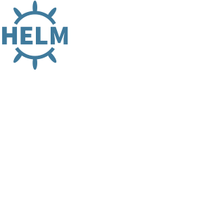

     

# Доставка микросервисов вместе с Helm Charts   

## Шаги, которые необходимы для прохождения задания

- Подготовить k8s окружение
- Подготовить helm (client-server)
- Подготовить helm chart
- Установить с помощью клиента
- Проверить результат работы

## Инструкция

- На каждом шаге будет инструкция, что мы делаем и зачем
- Для экономии времени, писать код не нужно. 
  - Достаточно **скопировать** команды из блока слева
  - Просто **кликните** указателем мыши **на блок кода** и он автоматически будет скопирован к вам в консоль